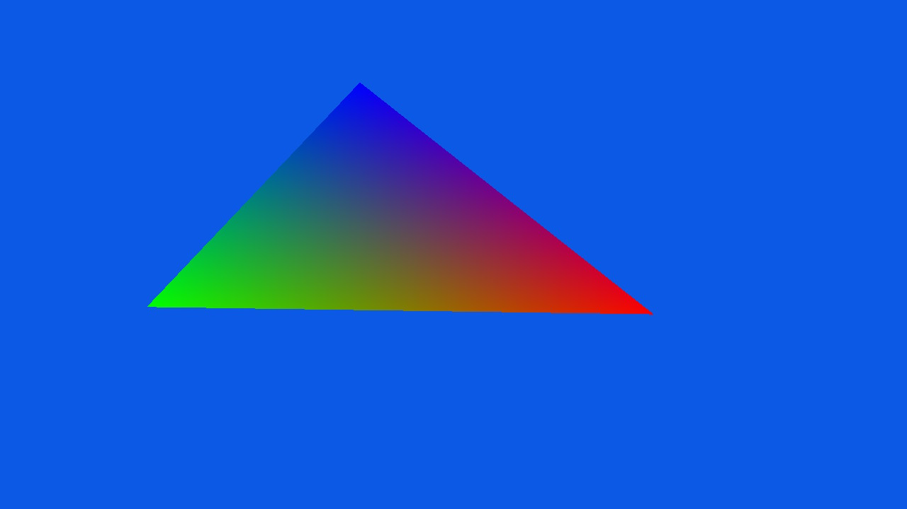

# NVK Triangle Test

Small Nintendo Switch homebrew example that renders a rotating triangle with
Vulkan through the NVK Switch path.



## Files

- `TriangleTest.cpp` - Vulkan setup, draw loop, and cleanup.
- `triangle.vert` / `triangle.frag` - GLSL shaders.
- `build.sh` - compiles shaders and builds `build/TriangleTest.nro`.

## Flow

1. Create the Vulkan instance and VI surface.
2. Pick a graphics queue that can present to the surface.
3. Create the device, swapchain, render pass, framebuffers, and pipeline.
4. Upload a host-visible vertex buffer.
5. Reuse one command buffer to draw and present until + is pressed.
6. Destroy Vulkan objects in reverse ownership order.

## Build

Build or pull Docker image first. In this workspace, build it from the Mesa tree
with:

```sh
../nvk-image/create-nvk-image.sh /path/to/mesa
```

Then build the example:

```sh
./build.sh
```

The script compiles the shaders, runs the build inside the Docker image, and
mounts this project automatically.
